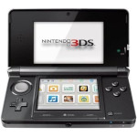

# Nintendo 3DS

  
|Component    |Description                                                  |
|-------------|-------------------------------------------------------------|
|CPU          |Dual-core ARM11 MPCore 268 MHz + Single-core ARM9            |
|GPU          |DMP PICA200 268MHz                                           |
|RAM          |128MB FCRAM, 6MB VRAM (Fujitsu MB82M8080-07L FC-RAM)         |
|Flash        |2GB                                                          |
|Top Screen   |3.53" 400x240                                                |
|Bottom Screen|3.02" 320x240 (Resistive Touch)                              |
|Slot         |Game Card and SDCard                                         |
|WLAN         |Wi-Fi 802.11 b/g                                             |
|Gamepad      |DPad, 4 Buttons, Start, Home, Select, L1, R1 and Analog Stick|
|Battery      |3.7V 1300mA                                                  |
|Dimension    |134mm x 74mm x 22mm                                          |
|Weight       |235g                                                         |

### https://steward-fu.github.io/website/index.htm
